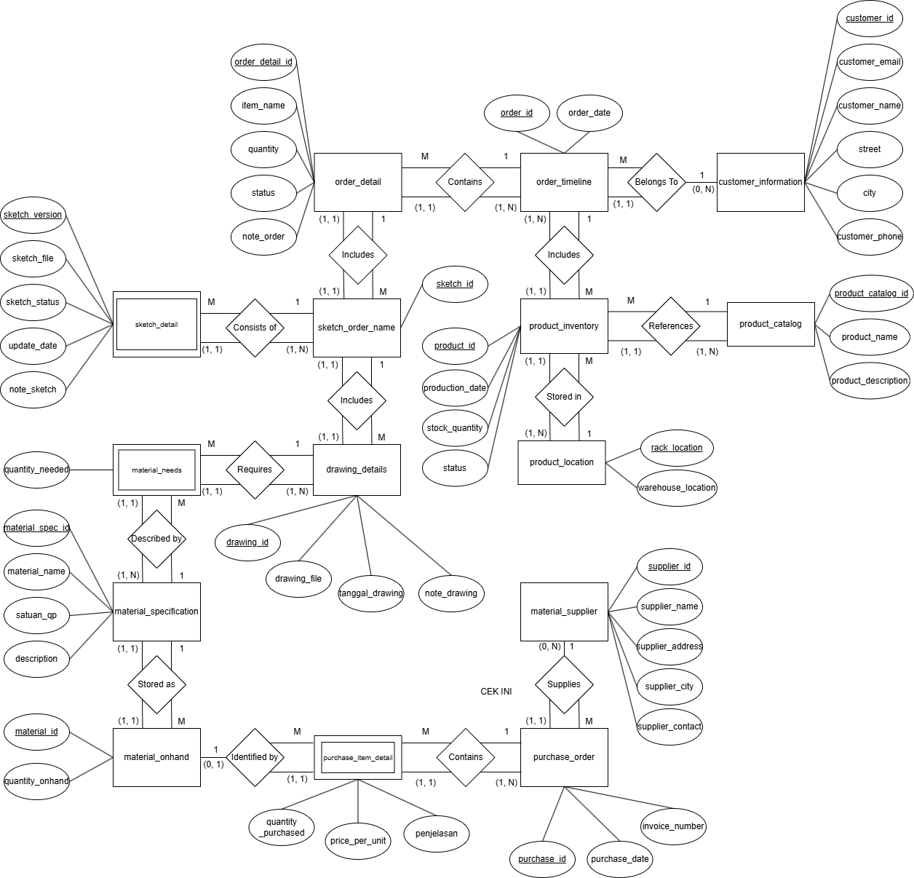

# 1. Peter Chen ERD

---

# 2. Tables

## 2.1. `order_detail`

| order_detail_id (PK) | item_name | order_id (FK) | quantity | status | note_order |
|---|---|---|---|---|---|
| OD001 | Cincin Filigree Silver | ORD001 | 2 | Diterima | Ukuran 6 dan 8 |
| OD002 | Anting Filigree | ORD001 | 1 | Diterima | Model kecil |
| OD003 | Bros Filigree | ORD001 | 1 | Diterima | Model bunga mawar |
| OD004 | Gelang Filigree | ORD002 | 1 | Ditolak | Stok kosong |
| OD005 | Liontin Filigree | ORD003 | 3 | Diterima | Dengan rantai perak |
| OD006 | Gelang Filigree Premium | ORD004 | 2 | Diproses | Finishing doff |
| OD007 | Vas Bunga Filigree Sedang | ORD005 | 1 | Diproses | Motif custom floral |

---

## 2.2. `order_timeline`

| order_id (PK) | customer_id (FK) | order_date |
|---|---|---|
| ORD001 | CUS001 | 2026-01-01 |
| ORD002 | CUS001 | 2026-01-02 |
| ORD003 | CUS003 | 2026-01-03 |
| ORD004 | CUS003 | 2026-01-04 |
| ORD005 | CUS005 | 2026-01-05 |

---

## 2.3. `customer_information`

| customer_id (PK) | customer_email | customer_name | street | city | customer_phone |
|---|---|---|---|---|---|
| CUS001 | siti.aminah@email.com | Ibu Siti Aminah | Jl. Melati No. 10 | Yogyakarta | 81234567890 |
| CUS002 | joko.w@email.com | Bapak Joko Widodo | Jl. Merapi No. 5 | Solo | 85678123456 |
| CUS003 | dewi.lestari@email.com | Ibu Dewi Lestari | Jl. Anggrek No. 22 | Jakarta | 87812345678 |
| CUS004 | ahmad.fauzi@email.com | Tn. Ahmad Fauzi | Jl. Kenanga No. 7 | Bandung | 82298765432 |
| CUS005 | rina.wijaya@email.com | Ny. Rina Wijaya | Jl. Mawar No. 15 | Surabaya | 83876543210 |

---

## 2.4. `sketch_order_name`

| sketch_id (PK) | order_detail_id (FK) |
|---|---|
| SK001 | OD001 |
| SK002 | OD002 |
| SK003 | OD003 |
| SK004 | OD005 |
| SK005 | OD005 |

---

## 2.5. `sketch_detail`

| sketch_id (PK/FK) | sketch_version (PK) | sketch_file | sketch_status | update_date | note_sketch |
|---|---|---|---|---|---|
| SK001 | v1 | sketches/ORD001_cincin_v1.jpg | Ditolak | 2025-12-20 | Desain terlalu simpel |
| SK001 | v2 | sketches/ORD001_cincin_v2.jpg | Diterima | 2025-12-25 | Revisi dengan tambahan ornamen |
| SK002 | v1 | sketches/ORD001_anting_v1.jpg | Ditolak | 2025-12-21 | Ukuran terlalu besar |
| SK002 | v2 | sketches/ORD001_anting_v2.jpg | Diterima | 2025-12-26 | Ukuran diperkecil |
| SK003 | v1 | sketches/ORD001_bros_v1.jpg | Diterima | 2025-12-28 | Model bunga mawar disetujui |
| SK004 | v1 | sketches/ORD003_liontin_v1.jpg | Diterima | 2025-12-27 | Motif sesuai permintaan |
| SK005 | v1 | sketches/ORD003_liontin_v2.jpg | Diterima | 2025-12-29 | Revisi rantai lebih tebal |

---

## 2.6. `drawing_details`

| drawing_id (PK) | sketch_id (FK) | drawing_file | tanggal_drawing | note_drawing |
|---|---|---|---|---|
| DRW001 | SK001 | engineering/ORD001_cincin_v2_eng.pdf | 2026-01-01 | Cincin ukuran 6 |
| DRW002 | SK001 | engineering/ORD001_cincin_v2_eng2.pdf | 2026-01-01 | Cincin ukuran 8 |
| DRW003 | SK002 | engineering/ORD001_anting_v2_eng.pdf | 2026-01-02 | Model kecil, sepasang |
| DRW004 | SK004 | engineering/ORD003_liontin_v2_eng.pdf | 2026-01-03 | Liontin dengan rantai |
| DRW005 | SK004 | engineering/ORD003_liontin_v2_eng2.pdf | 2026-01-03 | Detail sambungan rantai |

---

## 2.7. `material_needs`

| drawing_id (PK/FK) | material_spec_id (PK/FK) | quantity_needed |
|---|---|---|
| DRW001 | MS001 | 30 |
| DRW001 | MS002 | 5 |
| DRW001 | MS003 | 1 |
| DRW003 | MS001 | 20 |
| DRW003 | MS005 | 2 |

---

## 2.8. `material_specification`

| material_spec_id (PK) | material_name | satuan_qp | description |
|---|---|---|---|
| MS001 | Silver wire 0.8mm | cm | Kawat perak diameter 0.8mm untuk filigree |
| MS002 | Solder perak | gr | Bahan solder berbahan perak |
| MS003 | Silver band ukuran 6 | pcs | Ring band perak ukuran 6 |
| MS004 | Silver wire 0.6mm | cm | Kawat perak diameter 0.6mm untuk filigree |
| MS005 | Kait anting perak | pcs | Kait anting berbahan perak |

---

## 2.9. `material_onhand`

| material_id (PK) | material_spec_id (FK) | quantity_onhand |
|---|---|---|
| MAT001 | MS001 | 220 |
| MAT002 | MS001 | 50 |
| MAT003 | MS002 | 1000 |
| MAT004 | MS004 | 200 |
| MAT005 | MS005 | 500 |

---

## 2.10. `purchase_item_detail`

| purchase_id (PK/FK) | material_id (PK/FK) | quantity_purchased | price_per_unit | penjelasan |
|---|---|---|---|---|
| PUR001 | MAT001 | 150 | 18000 | Pembelian rutin bulanan |
| PUR001 | MAT004 | 150 | 16000 | Pembelian rutin bulanan |
| PUR002 | MAT002 | 50 | 18000 | Stok tambahan |
| PUR003 | MAT003 | 500 | 12000 | Pembelian solder perak |
| PUR004 | MAT005 | 300 | 2500 | - |
| PUR006 | MAT002 | 200 | 15000 | - |

---

## 2.11. `purchase_order`

| purchase_id (PK) | supplier_id (FK) | purchase_date | invoice_number |
|---|---|---|---|
| PUR001 | SUP001 | 2026-01-01 | INV/2026/001 |
| PUR002 | SUP001 | 2026-01-06 | INV/2026/015 |
| PUR003 | SUP002 | 2026-01-11 | INV/2026/023 |
| PUR004 | SUP003 | 2026-01-16 | INV/2026/045 |
| PUR006 | SUP006 | 2026-01-23 | INV/2026/089 |

---

## 2.12. `material_supplier`

| supplier_id (PK) | supplier_name | supplier_address | supplier_city | supplier_contact |
|---|---|---|---|---|
| SUP001 | PT Logam Mulia | Jl. Industri No. 5 | Jakarta | 021-5551234 |
| SUP002 | CV Perak Jaya | Jl. Raya Logam No. 10 | Surabaya | 031-7778899 |
| SUP003 | UD Logam Sentosa | Jl. Diponegoro No. 22 | Yogyakarta | 0274-888111 |
| SUP004 | Toko Emas Subur | Jl. Pasar Baru No. 7 | Bandung | 022-6664321 |
| SUP006 | CV Teknik Las | Jl. Veteran No. 15 | Semarang | 024-7771234 |

---

## 2.13. `product_inventory`

| product_id (PK) | order_id (FK) | product_catalog_id (FK) | rack_location (FK) | production_date | stock_quantity | status |
|---|---|---|---|---|---|---|
| PRD001 | ORD001 | PC001 | Rak A1 | 2026-01-13 | 1 | Dikirim |
| PRD002 | ORD001 | PC002 | Rak A1 | 2026-01-13 | 1 | Dikirim |
| PRD003 | ORD001 | PC003 | Rak A2 | 2026-01-14 | 1 | Dikirim |
| PRD004 | ORD003 | PC004 | Rak B1 | 2026-01-15 | 1 | Tersedia |
| PRD005 | ORD003 | PC004 | Rak D1 | 2026-01-15 | 1 | Tersedia |

---

## 2.14. `product_location`

| rack_location (PK) | warehouse_location |
|---|---|
| Rak A1 | Gudang Produk Jadi |
| Rak A2 | Gudang Produk Jadi |
| Rak B1 | Gudang Produk Jadi |
| Rak C1 | Gudang Produk Jadi |
| Rak D1 | Gudang Transit |

---

## 2.15. `product_catalog`

| product_catalog_id (PK) | product_name | product_description |
|---|---|---|
| PC001 | Cincin Filigree Silver Ukuran 6 | Cincin perak dengan ornamen filigree, ukuran 6 |
| PC002 | Cincin Filigree Silver Ukuran 8 | Cincin perak dengan ornamen filigree, ukuran 8 |
| PC003 | Anting Filigree Model Kecil | Anting perak model kecil dengan ornamen filigree, sepasang |
| PC004 | Liontin Filigree dengan Rantai | Liontin perak dengan ornamen filigree dan rantai 45cm |
| PC005 | Vas Bunga Filigree Ukuran Sedang | Vas bunga perak ukuran sedang dengan ornamen filigree |
